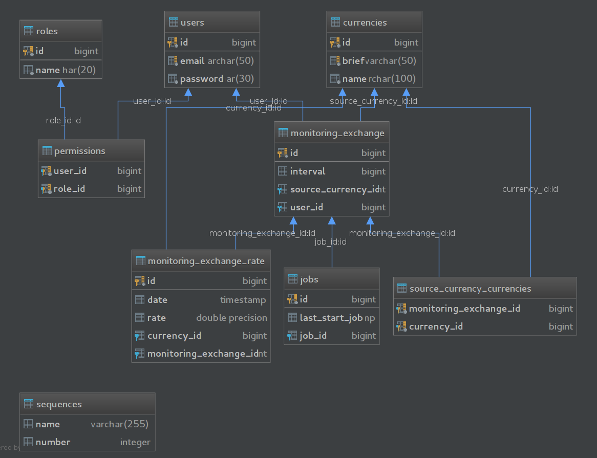

Описание проекта ExchangeRateInformation
========================================

1) Класс Role - роли пользователей 
   >Поля: (id, name) 
   
2) Класс User  - пользователь и его данные
   >Поля: (id, email, password, roles)
   
3) Класс Currency  - валюта
  >Поля: (id, brief, name)
  
4) Класс MonitoringExchange  - информация какой пользователь с каким интервалом отслеживает курс валюты
  >Поля: (id, user, sourceCurrency, interval, currencies)
  
5) Класс MonitoringExchangeRate  - информация о стоимости валюты в момент времени относительно MonitoringExchange
  >Поля: (id, currency, monitoringExchange, rate, date)
  
6) Класс Job  - информация о последнем отслеживании курса валюты MonitoringExchange
  >Поля: (id, lastStartJob, monitoringExchange)
  
<h2>Структура базы данных</h2>

